# Job Board System Architecture

## System Overview

The Job Board is a scalable job import system that fetches job listings from multiple sources, processes them asynchronously, and provides real-time tracking of import operations. The system is designed with scalability, reliability, and maintainability in mind.

## High-Level Architecture

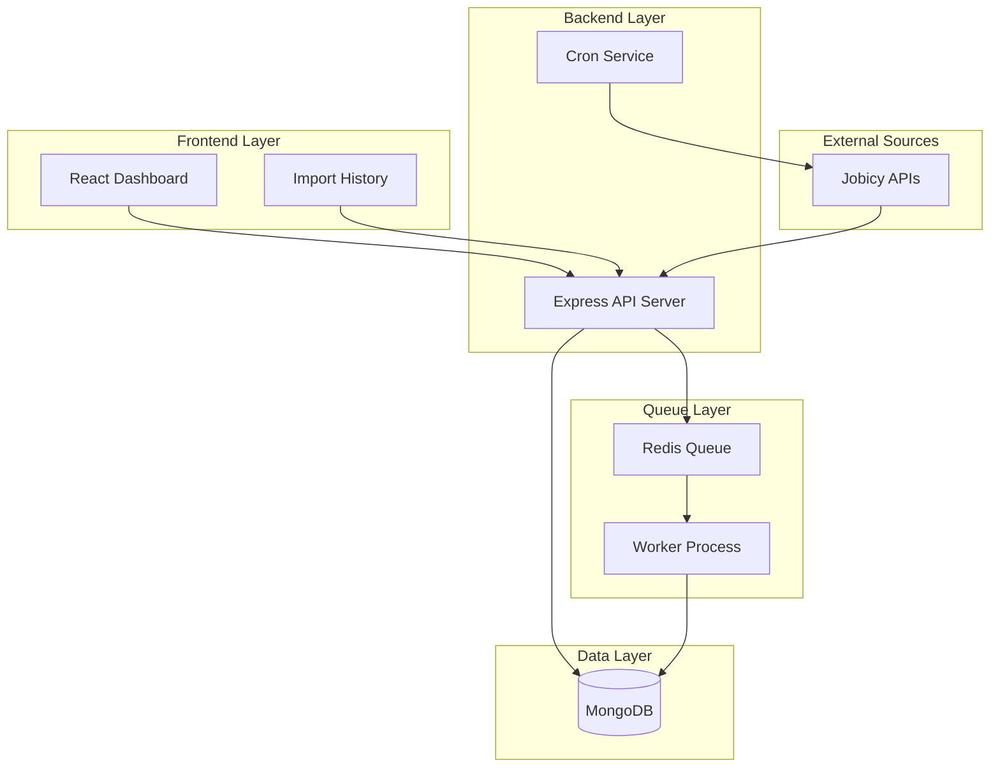

## Data Flow

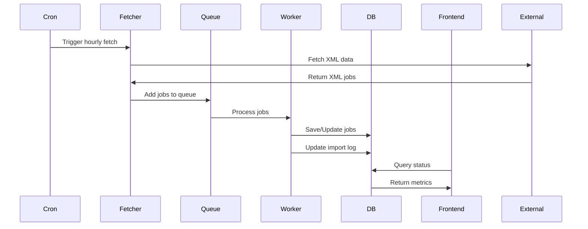

## Component Architecture

### 1. Job Source Integration

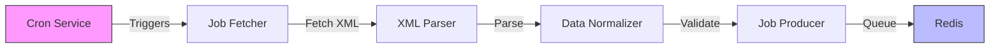

**Design Decisions:**
- XML parsing using xml2js for reliable conversion
- Source configuration in separate file for easy management
- Error handling with retries for network issues
- Data normalization for consistent storage

### 2. Queue System Architecture

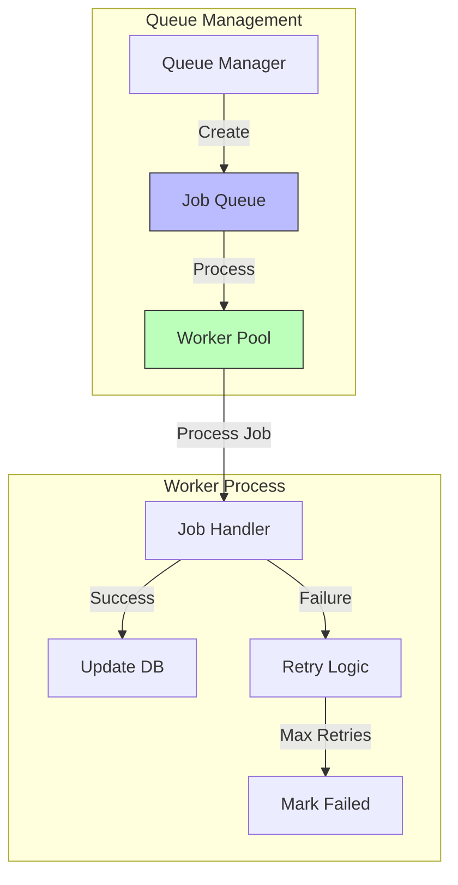

**Design Decisions:**
- BullMQ for robust queue handling
- Configurable concurrency (5 workers default)
- Exponential backoff for retries
- Separate queues per job type

### 3. Database Schema

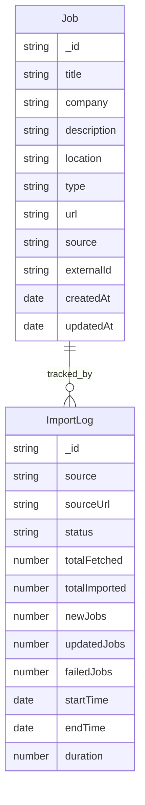

**Design Decisions:**
- Normalized schema for efficient querying
- Indexed fields for common queries
- Separate import logs for tracking
- Optimized for read performance

### 4. Frontend Component Structure

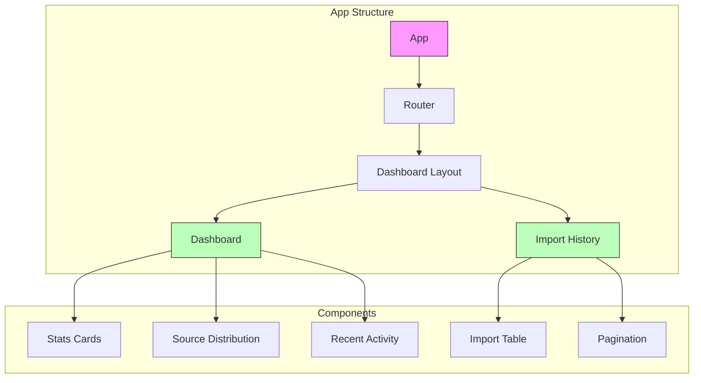

## Error Handling Strategy

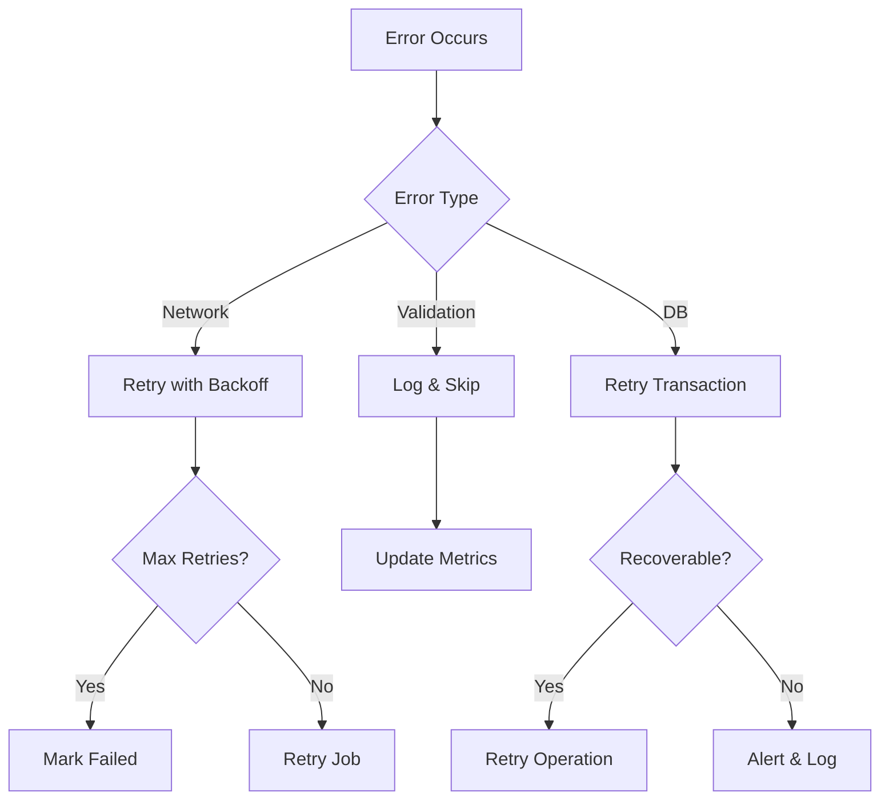

## Scalability Design

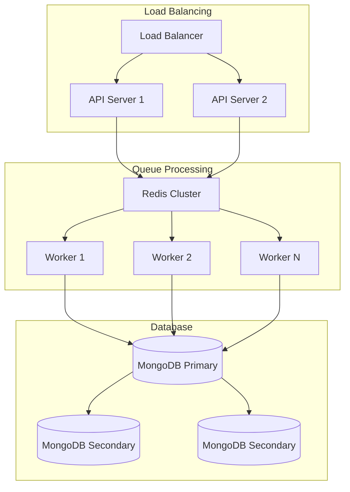

## Monitoring and Metrics

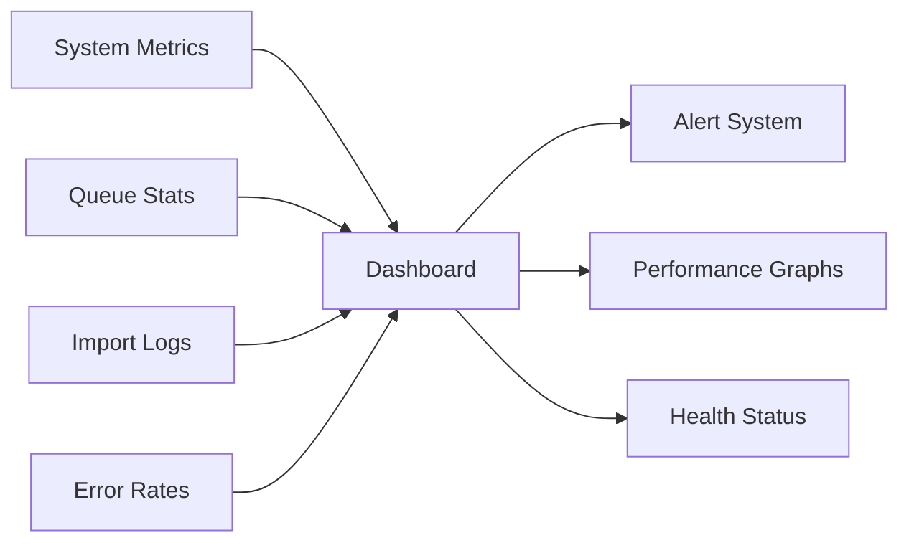

## Development Workflow

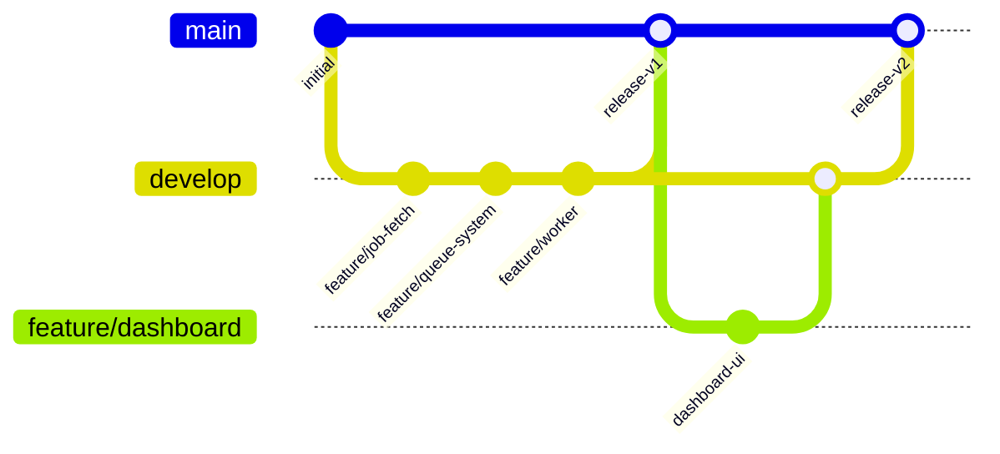

## Deployment Architecture

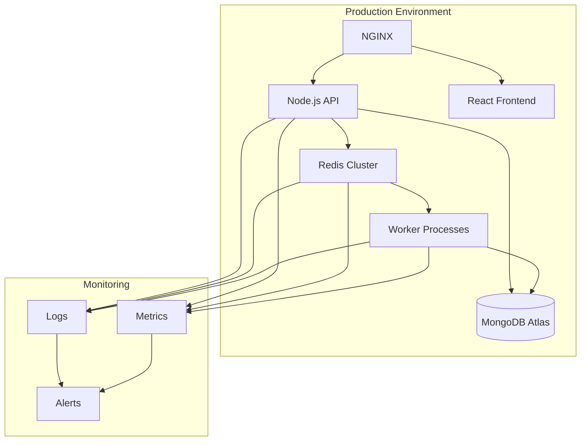